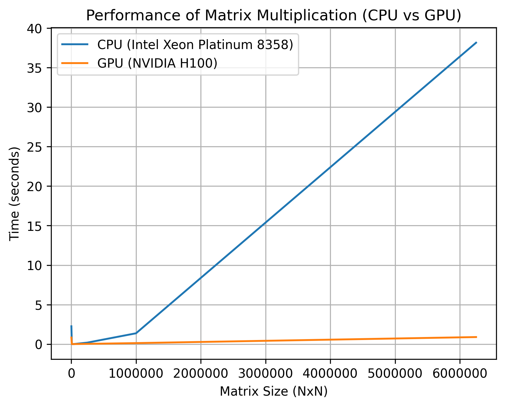

# MiniTorch Module 3


* Docs: https://minitorch.github.io/

* Overview: https://minitorch.github.io/module3.html


You will need to modify `tensor_functions.py` slightly in this assignment.

* Tests:

```
python run_tests.py
```

* Note:

Several of the tests for this assignment will only run if you are on a GPU machine and will not
run on github's test infrastructure. Please follow the instructions to setup up a colab machine
to run these tests.

This assignment requires the following files from the previous assignments. You can get these by running

```bash
python sync_previous_module.py previous-module-dir current-module-dir
```

The files that will be synced are:

        minitorch/tensor_data.py minitorch/tensor_functions.py minitorch/tensor_ops.py minitorch/operators.py minitorch/scalar.py minitorch/scalar_functions.py minitorch/module.py minitorch/autodiff.py minitorch/module.py project/run_manual.py project/run_scalar.py project/run_tensor.py minitorch/operators.py minitorch/module.py minitorch/autodiff.py minitorch/tensor.py minitorch/datasets.py minitorch/testing.py minitorch/optim.py

## Module 3.1 and 3.2 diagnostics:
```
MAP

================================================================================
 Parallel Accelerator Optimizing:  Function tensor_map.<locals>._map,
/home/dalalt1/MLE/mod3-TaykhoomDalal/minitorch/fast_ops.py (164)
================================================================================


Parallel loop listing for  Function tensor_map.<locals>._map, /home/dalalt1/MLE/mod3-TaykhoomDalal/minitorch/fast_ops.py (164)
--------------------------------------------------------------------------------------------------------------------|loop #ID
    def _map(                                                                                                       |
        out: Storage,                                                                                               |
        out_shape: Shape,                                                                                           |
        out_strides: Strides,                                                                                       |
        in_storage: Storage,                                                                                        |
        in_shape: Shape,                                                                                            |
        in_strides: Strides,                                                                                        |
    ) -> None:                                                                                                      |
        # TODO: Implement for Task 3.1.                                                                             |
        same_shape = len(in_shape) == len(out_shape) and np.all(in_shape == out_shape)------------------------------| #0
        same_strides = len(in_strides) == len(out_strides) and np.all(in_strides == out_strides)--------------------| #1
                                                                                                                    |
        if same_shape and same_strides:                                                                             |
            for i in prange(len(out)): # main loop in parallel & when out and in are stride-aligned, no indexing----| #2
                out[i] = fn(in_storage[i])                                                                          |
                                                                                                                    |
        else:                                                                                                       |
            for i in prange(len(out)): # main loop in parallel------------------------------------------------------| #3
                out_index: Index = np.empty(MAX_DIMS, dtype=np.int32) # indices use numpy buffers                   |
                in_index: Index = np.empty(MAX_DIMS, dtype=np.int32) # indices use numpy buffers                    |
                                                                                                                    |
                to_index(i, out_shape, out_index)                                                                   |
                o = index_to_position(out_index, out_strides)                                                       |
                                                                                                                    |
                broadcast_index(out_index, out_shape, in_shape, in_index)                                           |
                j = index_to_position(in_index, in_strides)                                                         |
                                                                                                                    |
                out[o] = fn(in_storage[j])                                                                          |
--------------------------------- Fusing loops ---------------------------------
Attempting fusion of parallel loops (combines loops with similar properties)...
Following the attempted fusion of parallel for-loops there are 4 parallel for-
loop(s) (originating from loops labelled: #0, #1, #2, #3).
--------------------------------------------------------------------------------
----------------------------- Before Optimisation ------------------------------
--------------------------------------------------------------------------------
------------------------------ After Optimisation ------------------------------
Parallel structure is already optimal.
--------------------------------------------------------------------------------
--------------------------------------------------------------------------------

---------------------------Loop invariant code motion---------------------------
Allocation hoisting:
The memory allocation derived from the instruction at
/home/dalalt1/MLE/mod3-TaykhoomDalal/minitorch/fast_ops.py (182) is hoisted out
of the parallel loop labelled #3 (it will be performed before the loop is
executed and reused inside the loop):
   Allocation:: out_index: Index = np.empty(MAX_DIMS, dtype=np.int32) # indices
use numpy buffers
    - numpy.empty() is used for the allocation.
The memory allocation derived from the instruction at
/home/dalalt1/MLE/mod3-TaykhoomDalal/minitorch/fast_ops.py (183) is hoisted out
of the parallel loop labelled #3 (it will be performed before the loop is
executed and reused inside the loop):
   Allocation:: in_index: Index = np.empty(MAX_DIMS, dtype=np.int32) # indices
use numpy buffers
    - numpy.empty() is used for the allocation.
None
ZIP

================================================================================
 Parallel Accelerator Optimizing:  Function tensor_zip.<locals>._zip,
/home/dalalt1/MLE/mod3-TaykhoomDalal/minitorch/fast_ops.py (219)
================================================================================


Parallel loop listing for  Function tensor_zip.<locals>._zip, /home/dalalt1/MLE/mod3-TaykhoomDalal/minitorch/fast_ops.py (219)
-------------------------------------------------------------------------------------------------------------------|loop #ID
    def _zip(                                                                                                      |
        out: Storage,                                                                                              |
        out_shape: Shape,                                                                                          |
        out_strides: Strides,                                                                                      |
        a_storage: Storage,                                                                                        |
        a_shape: Shape,                                                                                            |
        a_strides: Strides,                                                                                        |
        b_storage: Storage,                                                                                        |
        b_shape: Shape,                                                                                            |
        b_strides: Strides,                                                                                        |
    ) -> None:                                                                                                     |
        # TODO: Implement for Task 3.1.                                                                            |
        same_shape = (                                                                                             |
            len(a_shape) == len(b_shape)                                                                           |
            and len(b_shape) == len(out_shape)                                                                     |
            and np.all(a_shape == b_shape)-------------------------------------------------------------------------| #4
            and np.all(b_shape == out_shape)-----------------------------------------------------------------------| #5
        )                                                                                                          |
        same_strides = (                                                                                           |
            len(a_strides) == len(b_strides)                                                                       |
            and len(b_strides) == len(out_strides)                                                                 |
            and np.all(a_strides == b_strides)---------------------------------------------------------------------| #6
            and np.all(b_strides == out_strides)-------------------------------------------------------------------| #7
        )                                                                                                          |
                                                                                                                   |
        if same_shape and same_strides:                                                                            |
            for i in prange(len(out)): # main loop in parallel & when out, a, b are stride-aligned, no indexing----| #8
                out[i] = fn(a_storage[i], b_storage[i])                                                            |
                                                                                                                   |
        else:                                                                                                      |
            for i in prange(len(out)): # main loop in parallel-----------------------------------------------------| #9
                out_index: Index = np.empty(MAX_DIMS, dtype=np.int32) # indices use numpy buffers                  |
                a_index: Index = np.empty(MAX_DIMS, dtype=np.int32) # indices use numpy buffers                    |
                b_index: Index = np.empty(MAX_DIMS, dtype=np.int32) # indices use numpy buffers                    |
                                                                                                                   |
                to_index(i, out_shape, out_index)                                                                  |
                o = index_to_position(out_index, out_strides)                                                      |
                                                                                                                   |
                # A                                                                                                |
                broadcast_index(out_index, out_shape, a_shape, a_index)                                            |
                j = index_to_position(a_index, a_strides)                                                          |
                                                                                                                   |
                # B                                                                                                |
                broadcast_index(out_index, out_shape, b_shape, b_index)                                            |
                k = index_to_position(b_index, b_strides)                                                          |
                                                                                                                   |
                out[o] = fn(a_storage[j], b_storage[k])                                                            |
--------------------------------- Fusing loops ---------------------------------
Attempting fusion of parallel loops (combines loops with similar properties)...
Following the attempted fusion of parallel for-loops there are 6 parallel for-
loop(s) (originating from loops labelled: #4, #5, #6, #7, #8, #9).
--------------------------------------------------------------------------------
----------------------------- Before Optimisation ------------------------------
--------------------------------------------------------------------------------
------------------------------ After Optimisation ------------------------------
Parallel structure is already optimal.
--------------------------------------------------------------------------------
--------------------------------------------------------------------------------

---------------------------Loop invariant code motion---------------------------
Allocation hoisting:
The memory allocation derived from the instruction at
/home/dalalt1/MLE/mod3-TaykhoomDalal/minitorch/fast_ops.py (250) is hoisted out
of the parallel loop labelled #9 (it will be performed before the loop is
executed and reused inside the loop):
   Allocation:: out_index: Index = np.empty(MAX_DIMS, dtype=np.int32) # indices
use numpy buffers
    - numpy.empty() is used for the allocation.
The memory allocation derived from the instruction at
/home/dalalt1/MLE/mod3-TaykhoomDalal/minitorch/fast_ops.py (251) is hoisted out
of the parallel loop labelled #9 (it will be performed before the loop is
executed and reused inside the loop):
   Allocation:: a_index: Index = np.empty(MAX_DIMS, dtype=np.int32) # indices
use numpy buffers
    - numpy.empty() is used for the allocation.
The memory allocation derived from the instruction at
/home/dalalt1/MLE/mod3-TaykhoomDalal/minitorch/fast_ops.py (252) is hoisted out
of the parallel loop labelled #9 (it will be performed before the loop is
executed and reused inside the loop):
   Allocation:: b_index: Index = np.empty(MAX_DIMS, dtype=np.int32) # indices
use numpy buffers
    - numpy.empty() is used for the allocation.
None
REDUCE

================================================================================
 Parallel Accelerator Optimizing:  Function tensor_reduce.<locals>._reduce,
/home/dalalt1/MLE/mod3-TaykhoomDalal/minitorch/fast_ops.py (291)
================================================================================


Parallel loop listing for  Function tensor_reduce.<locals>._reduce, /home/dalalt1/MLE/mod3-TaykhoomDalal/minitorch/fast_ops.py (291)
--------------------------------------------------------------------------------------------------------------------|loop #ID
    def _reduce(                                                                                                    |
        out: Storage,                                                                                               |
        out_shape: Shape,                                                                                           |
        out_strides: Strides,                                                                                       |
        a_storage: Storage,                                                                                         |
        a_shape: Shape,                                                                                             |
        a_strides: Strides,                                                                                         |
        reduce_dim: int,                                                                                            |
    ) -> None:                                                                                                      |
        # TODO: Implement for Task 3.1.                                                                             |
                                                                                                                    |
        reduce_size = a_shape[reduce_dim]                                                                           |
        for i in prange(len(out)): # main loop in parallel----------------------------------------------------------| #10
            out_index = np.empty(MAX_DIMS, dtype=np.int32) # indices use numpy buffers                              |
            to_index(i, out_shape, out_index)                                                                       |
                                                                                                                    |
            o = index_to_position(out_index, out_strides)                                                           |
                                                                                                                    |
            reduced_val = out[o]                                                                                    |
                                                                                                                    |
            for s in range(reduce_size): # inner-loop should not call any functions or write non-local variables    |
                out_index[reduce_dim] = s                                                                           |
                j = index_to_position(out_index, a_strides)                                                         |
                reduced_val = fn(reduced_val, a_storage[j])                                                         |
                                                                                                                    |
            out[o] = reduced_val                                                                                    |
--------------------------------- Fusing loops ---------------------------------
Attempting fusion of parallel loops (combines loops with similar properties)...
Following the attempted fusion of parallel for-loops there are 1 parallel for-
loop(s) (originating from loops labelled: #10).
--------------------------------------------------------------------------------
----------------------------- Before Optimisation ------------------------------
--------------------------------------------------------------------------------
------------------------------ After Optimisation ------------------------------
Parallel structure is already optimal.
--------------------------------------------------------------------------------
--------------------------------------------------------------------------------

---------------------------Loop invariant code motion---------------------------
Allocation hoisting:
The memory allocation derived from the instruction at
/home/dalalt1/MLE/mod3-TaykhoomDalal/minitorch/fast_ops.py (304) is hoisted out
of the parallel loop labelled #10 (it will be performed before the loop is
executed and reused inside the loop):
   Allocation:: out_index = np.empty(MAX_DIMS, dtype=np.int32) # indices use
numpy buffers
    - numpy.empty() is used for the allocation.
None
MATRIX MULTIPLY

================================================================================
 Parallel Accelerator Optimizing:  Function _tensor_matrix_multiply,
/home/dalalt1/MLE/mod3-TaykhoomDalal/minitorch/fast_ops.py (321)
================================================================================


Parallel loop listing for  Function _tensor_matrix_multiply, /home/dalalt1/MLE/mod3-TaykhoomDalal/minitorch/fast_ops.py (321)
-----------------------------------------------------------------------------------------------|loop #ID
def _tensor_matrix_multiply(                                                                   |
    out: Storage,                                                                              |
    out_shape: Shape,                                                                          |
    out_strides: Strides,                                                                      |
    a_storage: Storage,                                                                        |
    a_shape: Shape,                                                                            |
    a_strides: Strides,                                                                        |
    b_storage: Storage,                                                                        |
    b_shape: Shape,                                                                            |
    b_strides: Strides,                                                                        |
) -> None:                                                                                     |
    """NUMBA tensor matrix multiply function.                                                  |
                                                                                               |
    Should work for any tensor shapes that broadcast as long as                                |
                                                                                               |
    ```                                                                                        |
    assert a_shape[-1] == b_shape[-2]                                                          |
    ```                                                                                        |
                                                                                               |
    Optimizations:                                                                             |
                                                                                               |
    * Outer loop in parallel                                                                   |
    * No index buffers or function calls                                                       |
    * Inner loop should have no global writes, 1 multiply.                                     |
                                                                                               |
                                                                                               |
    Args:                                                                                      |
    ----                                                                                       |
        out (Storage): storage for `out` tensor                                                |
        out_shape (Shape): shape for `out` tensor                                              |
        out_strides (Strides): strides for `out` tensor                                        |
        a_storage (Storage): storage for `a` tensor                                            |
        a_shape (Shape): shape for `a` tensor                                                  |
        a_strides (Strides): strides for `a` tensor                                            |
        b_storage (Storage): storage for `b` tensor                                            |
        b_shape (Shape): shape for `b` tensor                                                  |
        b_strides (Strides): strides for `b` tensor                                            |
                                                                                               |
    Returns:                                                                                   |
    -------                                                                                    |
        None : Fills in `out`                                                                  |
                                                                                               |
    """                                                                                        |
    a_batch_stride = a_strides[0] if a_shape[0] > 1 else 0                                     |
    b_batch_stride = b_strides[0] if b_shape[0] > 1 else 0                                     |
                                                                                               |
    # TODO: Implement for Task 3.2.                                                            |
                                                                                               |
    for n in prange(out_shape[0]): # outer loop in parallel with no index buffers--------------| #11
        for i in range(out_shape[-2]):                                                         |
            for j in range(out_shape[-1]):                                                     |
                val = 0                                                                        |
                a_linear_index = n * a_batch_stride + i * a_strides[-2]                        |
                b_linear_index = n * b_batch_stride + j * b_strides[-1]                        |
                for _ in range(a_shape[-1]): # inner loop with no global writes, 1 multiply    |
                    val += a_storage[a_linear_index] * b_storage[b_linear_index]               |
                    a_linear_index += a_strides[-1]                                            |
                    b_linear_index += b_strides[-2]                                            |
                out_index = (                                                                  |
                    n * out_strides[0] + i * out_strides[-2] + j * out_strides[-1]             |
                )                                                                              |
                out[out_index] = val                                                           |
--------------------------------- Fusing loops ---------------------------------
Attempting fusion of parallel loops (combines loops with similar properties)...
Following the attempted fusion of parallel for-loops there are 1 parallel for-
loop(s) (originating from loops labelled: #11).
--------------------------------------------------------------------------------
----------------------------- Before Optimisation ------------------------------
--------------------------------------------------------------------------------
------------------------------ After Optimisation ------------------------------
Parallel structure is already optimal.
--------------------------------------------------------------------------------
--------------------------------------------------------------------------------

---------------------------Loop invariant code motion---------------------------
Allocation hoisting:
No allocation hoisting found
None
```

## Module 3.4 Graph Comparison:


## Module 3.5 Training Results:

### Simple Data Set

#### CPU
`python run_fast_tensor.py --BACKEND cpu --HIDDEN 100 --DATASET simple --RATE 0.08`
```
Epoch  0  loss  2.8741400028232587  correct  42  time per epoch  14.344388008117676
Epoch  10  loss  1.1498898105571866  correct  49  time per epoch  0.04567432403564453
Epoch  20  loss  1.4385215457324543  correct  49  time per epoch  0.04581475257873535
Epoch  30  loss  0.8926778897733686  correct  49  time per epoch  0.045687198638916016
Epoch  40  loss  0.32791552400234675  correct  50  time per epoch  0.04868626594543457
Epoch  50  loss  0.049056549899038376  correct  48  time per epoch  0.04561758041381836
Epoch  60  loss  1.147548864209046  correct  50  time per epoch  0.045662641525268555
Epoch  70  loss  0.03674144081385565  correct  47  time per epoch  0.04562950134277344
Epoch  80  loss  0.011242655247772793  correct  50  time per epoch  0.04568147659301758
Epoch  90  loss  1.273127692763083  correct  50  time per epoch  0.04569053649902344
Epoch  100  loss  0.049966653775935746  correct  50  time per epoch  0.04563546180725098
Epoch  110  loss  0.08040052797094857  correct  50  time per epoch  0.04556417465209961
Epoch  120  loss  0.30816828074226676  correct  49  time per epoch  0.0457003116607666
Epoch  130  loss  0.06648360080899957  correct  50  time per epoch  0.045676469802856445
Epoch  140  loss  0.019412421450941054  correct  49  time per epoch  0.0456695556640625
Epoch  150  loss  0.730219312931635  correct  50  time per epoch  0.045772552490234375
Epoch  160  loss  0.03128395489417888  correct  50  time per epoch  0.045798301696777344
Epoch  170  loss  0.004175813560564465  correct  50  time per epoch  0.04579043388366699
Epoch  180  loss  0.06354323000242179  correct  49  time per epoch  0.04571247100830078
Epoch  190  loss  0.7334845423868304  correct  49  time per epoch  0.0456538200378418
Epoch  200  loss  0.7049343588361612  correct  49  time per epoch  0.04576849937438965
Epoch  210  loss  0.030908613804227936  correct  49  time per epoch  0.045731544494628906
Epoch  220  loss  1.143619926725236  correct  49  time per epoch  0.045688629150390625
Epoch  230  loss  0.026070393851590424  correct  50  time per epoch  0.04562544822692871
Epoch  240  loss  0.8502161115442787  correct  50  time per epoch  0.04557538032531738
Epoch  250  loss  0.27455587790405905  correct  50  time per epoch  0.04566621780395508
Epoch  260  loss  0.0711240815488714  correct  50  time per epoch  0.04561471939086914
Epoch  270  loss  0.576986148668608  correct  50  time per epoch  0.04564952850341797
Epoch  280  loss  0.6560775861588751  correct  50  time per epoch  0.04565286636352539
Epoch  290  loss  0.26081250841717585  correct  50  time per epoch  0.04572868347167969
Epoch  300  loss  0.0014707914294025731  correct  47  time per epoch  0.04564261436462402
Epoch  310  loss  0.945917921546175  correct  49  time per epoch  0.04568839073181152
Epoch  320  loss  0.03947618323442031  correct  50  time per epoch  0.04559183120727539
Epoch  330  loss  0.051089088294022804  correct  50  time per epoch  0.045644283294677734
Epoch  340  loss  0.1736711002482438  correct  50  time per epoch  0.04560446739196777
Epoch  350  loss  0.420068281229644  correct  50  time per epoch  0.04556751251220703
Epoch  360  loss  0.16478594282328235  correct  49  time per epoch  0.045623064041137695
Epoch  370  loss  0.5067001245979956  correct  50  time per epoch  0.046111106872558594
Epoch  380  loss  0.0017928102648642856  correct  50  time per epoch  0.0456233024597168
Epoch  390  loss  0.4925439607077679  correct  50  time per epoch  0.04565715789794922
Epoch  400  loss  0.044307153485260625  correct  49  time per epoch  0.04562783241271973
Epoch  410  loss  6.0017684635884285e-05  correct  50  time per epoch  0.04556155204772949
Epoch  420  loss  0.5968074378941263  correct  50  time per epoch  0.045906782150268555
Epoch  430  loss  1.1468239726884877  correct  48  time per epoch  0.04561448097229004
Epoch  440  loss  0.012739623885819477  correct  49  time per epoch  0.04567456245422363
Epoch  450  loss  0.01606804572745185  correct  50  time per epoch  0.0456395149230957
Epoch  460  loss  0.00032559612104894175  correct  48  time per epoch  0.045749664306640625
Epoch  470  loss  0.993624458544529  correct  48  time per epoch  0.04574728012084961
Epoch  480  loss  0.391213702975791  correct  50  time per epoch  0.04570150375366211
Epoch  490  loss  0.0016367817972024862  correct  50  time per epoch  0.04563164710998535
Average time per epoch 0.0743176922798156
```

#### GPU
`python run_fast_tensor.py --BACKEND gpu --HIDDEN 100 --DATASET simple --RATE 0.05`
```
Epoch  0  loss  5.336838592490573  correct  46  time per epoch  2.854010581970215
Epoch  10  loss  0.9129724724696086  correct  48  time per epoch  1.0251553058624268
Epoch  20  loss  1.5519733058641483  correct  49  time per epoch  1.0245823860168457
Epoch  30  loss  0.6205379825857894  correct  50  time per epoch  1.0274956226348877
Epoch  40  loss  0.224323827539813  correct  50  time per epoch  1.0352094173431396
Epoch  50  loss  0.18771321979908376  correct  50  time per epoch  1.062185525894165
Epoch  60  loss  0.3715796765042974  correct  50  time per epoch  1.0261547565460205
Epoch  70  loss  0.42151364827791593  correct  50  time per epoch  1.0258567333221436
Epoch  80  loss  0.48530239266235453  correct  50  time per epoch  1.0248675346374512
Epoch  90  loss  0.3657338206011644  correct  50  time per epoch  1.026064157485962
Epoch  100  loss  0.1030634212271382  correct  49  time per epoch  1.062859296798706
Epoch  110  loss  0.40832230301546213  correct  50  time per epoch  1.0321815013885498
Epoch  120  loss  0.012359061263882528  correct  50  time per epoch  1.0290577411651611
Epoch  130  loss  0.22196712191439533  correct  50  time per epoch  1.0236363410949707
Epoch  140  loss  0.3370011427715546  correct  50  time per epoch  1.0215520858764648
Epoch  150  loss  0.2771543866099133  correct  50  time per epoch  1.0640859603881836
Epoch  160  loss  0.021965351692409853  correct  50  time per epoch  1.0225067138671875
Epoch  170  loss  0.16887525494518663  correct  50  time per epoch  1.0242879390716553
Epoch  180  loss  0.14379508290721227  correct  50  time per epoch  1.0269644260406494
Epoch  190  loss  0.1901571311631068  correct  50  time per epoch  1.0270254611968994
Epoch  200  loss  0.22626848870656813  correct  50  time per epoch  1.0253760814666748
Epoch  210  loss  0.06366974645481177  correct  50  time per epoch  1.026859998703003
Epoch  220  loss  0.2760038578472667  correct  50  time per epoch  1.0293707847595215
Epoch  230  loss  0.1606192366915529  correct  50  time per epoch  1.0269391536712646
Epoch  240  loss  0.06713949376507586  correct  50  time per epoch  1.0258417129516602
Epoch  250  loss  0.0047211623120404994  correct  50  time per epoch  1.0281555652618408
Epoch  260  loss  0.1955850368085547  correct  50  time per epoch  1.0206401348114014
Epoch  270  loss  0.11247294601835997  correct  50  time per epoch  1.0230154991149902
Epoch  280  loss  0.20698258083216933  correct  50  time per epoch  1.0231287479400635
Epoch  290  loss  0.044841981061602795  correct  50  time per epoch  1.0286848545074463
Epoch  300  loss  0.12264115293353323  correct  50  time per epoch  1.0194315910339355
Epoch  310  loss  0.13168359499561777  correct  50  time per epoch  1.025331735610962
Epoch  320  loss  0.09357793170390576  correct  50  time per epoch  1.019174337387085
Epoch  330  loss  0.06638417339901566  correct  50  time per epoch  1.020885944366455
Epoch  340  loss  0.10530497353372865  correct  50  time per epoch  1.0232653617858887
Epoch  350  loss  7.030846023931026e-05  correct  50  time per epoch  1.0260984897613525
Epoch  360  loss  0.11821877330251894  correct  50  time per epoch  1.0215461254119873
Epoch  370  loss  0.01287882817067021  correct  50  time per epoch  1.018484115600586
Epoch  380  loss  0.003973118558889619  correct  50  time per epoch  1.0222392082214355
Epoch  390  loss  7.349953235600739e-05  correct  50  time per epoch  1.0242984294891357
Epoch  400  loss  0.0036028270083883415  correct  50  time per epoch  1.0205395221710205
Epoch  410  loss  0.04653996869998527  correct  50  time per epoch  1.0247321128845215
Epoch  420  loss  0.0804243199300606  correct  50  time per epoch  1.0195231437683105
Epoch  430  loss  0.01229772232982015  correct  50  time per epoch  1.0576095581054688
Epoch  440  loss  0.043348391049180326  correct  50  time per epoch  1.0208075046539307
Epoch  450  loss  0.0048164476202496274  correct  50  time per epoch  1.0204353332519531
Epoch  460  loss  0.028730692938210612  correct  50  time per epoch  1.0219438076019287
Epoch  470  loss  0.010734516675830388  correct  50  time per epoch  1.0187411308288574
Epoch  480  loss  0.08964182450351524  correct  50  time per epoch  1.0640199184417725
Epoch  490  loss  0.08923237303416995  correct  50  time per epoch  1.0214836597442627
Average time per epoch 1.034164375782013
```

### Simple Data Set (with larger model)

#### CPU
`python run_fast_tensor.py --BACKEND cpu --HIDDEN 200 --DATASET simple --RATE 0.05`
```
Epoch  0  loss  3.8241489038044065  correct  43  time per epoch  14.416544437408447
Epoch  10  loss  1.648518983172874  correct  49  time per epoch  0.1128225326538086
Epoch  20  loss  1.4348153441076121  correct  50  time per epoch  0.11235809326171875
Epoch  30  loss  0.75474464743271  correct  50  time per epoch  0.11230850219726562
Epoch  40  loss  0.20899432265782455  correct  50  time per epoch  0.11217689514160156
Epoch  50  loss  1.1905019865153503  correct  50  time per epoch  0.11218118667602539
Epoch  60  loss  1.147767713970897  correct  50  time per epoch  0.11243057250976562
Epoch  70  loss  0.008020821843579494  correct  47  time per epoch  0.11216974258422852
Epoch  80  loss  0.532276447668094  correct  50  time per epoch  0.11251997947692871
Epoch  90  loss  0.5861304514217385  correct  50  time per epoch  0.11228752136230469
Epoch  100  loss  0.37030049380801033  correct  50  time per epoch  0.1124575138092041
Epoch  110  loss  0.2184487122006579  correct  50  time per epoch  0.11241459846496582
Epoch  120  loss  0.5585967545014612  correct  50  time per epoch  0.1126554012298584
Epoch  130  loss  0.428558093067451  correct  50  time per epoch  0.11250710487365723
Epoch  140  loss  0.011788199731485226  correct  50  time per epoch  0.11240839958190918
Epoch  150  loss  0.7284766069868233  correct  50  time per epoch  0.11501598358154297
Epoch  160  loss  0.5885642977657077  correct  50  time per epoch  0.1126096248626709
Epoch  170  loss  0.31422200825528845  correct  50  time per epoch  0.11225605010986328
Epoch  180  loss  0.031807211741666466  correct  50  time per epoch  0.1120150089263916
Epoch  190  loss  0.05630149034312132  correct  50  time per epoch  0.11234402656555176
Epoch  200  loss  0.35233310375266635  correct  50  time per epoch  0.11241841316223145
Epoch  210  loss  0.20310870588952518  correct  50  time per epoch  0.11215424537658691
Epoch  220  loss  0.3068944456072011  correct  50  time per epoch  0.11236977577209473
Epoch  230  loss  0.0004417997161991528  correct  50  time per epoch  0.11208796501159668
Epoch  240  loss  0.0650864051081802  correct  50  time per epoch  0.11237645149230957
Epoch  250  loss  0.07492165812284998  correct  50  time per epoch  0.1127474308013916
Epoch  260  loss  0.11364392881526028  correct  50  time per epoch  0.11213994026184082
Epoch  270  loss  0.14018499642025803  correct  50  time per epoch  0.11234331130981445
Epoch  280  loss  0.1673309412571746  correct  50  time per epoch  0.11238455772399902
Epoch  290  loss  0.0029910743959946726  correct  50  time per epoch  0.1117544174194336
Epoch  300  loss  0.08893943454923288  correct  50  time per epoch  0.11223101615905762
Epoch  310  loss  0.007164355569556571  correct  50  time per epoch  0.11245131492614746
Epoch  320  loss  0.1447271511751236  correct  50  time per epoch  0.11227798461914062
Epoch  330  loss  0.09126345189251583  correct  50  time per epoch  0.1121370792388916
Epoch  340  loss  0.2788386178418135  correct  50  time per epoch  0.11223077774047852
Epoch  350  loss  0.05493759147991741  correct  50  time per epoch  0.11207175254821777
Epoch  360  loss  0.12720296648077167  correct  50  time per epoch  0.1123647689819336
Epoch  370  loss  0.12230248565927175  correct  50  time per epoch  0.11202669143676758
Epoch  380  loss  0.057214720430130164  correct  50  time per epoch  0.1122746467590332
Epoch  390  loss  0.22790820408394688  correct  50  time per epoch  0.11249232292175293
Epoch  400  loss  0.01957921138409285  correct  50  time per epoch  0.11248469352722168
Epoch  410  loss  0.09660783386053177  correct  50  time per epoch  0.11221814155578613
Epoch  420  loss  0.01518604557856199  correct  50  time per epoch  0.11229944229125977
Epoch  430  loss  0.016186380964362798  correct  50  time per epoch  0.11220812797546387
Epoch  440  loss  0.18982489132309102  correct  50  time per epoch  0.1123204231262207
Epoch  450  loss  0.032494733744879344  correct  50  time per epoch  0.11330342292785645
Epoch  460  loss  0.12910160567187606  correct  50  time per epoch  0.11260414123535156
Epoch  470  loss  0.0020149665685943977  correct  50  time per epoch  0.1123507022857666
Epoch  480  loss  0.10713839920168028  correct  50  time per epoch  0.11249256134033203
Epoch  490  loss  0.1515111030194788  correct  50  time per epoch  0.11270761489868164
Average time per epoch 0.14099079084396363
```

#### GPU
`python run_fast_tensor.py --BACKEND gpu --HIDDEN 200 --DATASET simple --RATE 0.05`
```
Epoch  0  loss  19.52830184795144  correct  31  time per epoch  2.8386738300323486
Epoch  10  loss  1.1384368677254924  correct  49  time per epoch  1.0715601444244385
Epoch  20  loss  1.1073556043216892  correct  49  time per epoch  1.0727496147155762
Epoch  30  loss  0.20435546657579334  correct  48  time per epoch  1.071946144104004
Epoch  40  loss  0.2798753137557645  correct  49  time per epoch  1.0749850273132324
Epoch  50  loss  1.702066150396166  correct  49  time per epoch  1.1111712455749512
Epoch  60  loss  1.2276569932791357  correct  50  time per epoch  1.0726902484893799
Epoch  70  loss  0.8170162674488263  correct  49  time per epoch  1.0689105987548828
Epoch  80  loss  1.2481086289118457  correct  50  time per epoch  1.074995756149292
Epoch  90  loss  0.4028173016678653  correct  50  time per epoch  1.0700342655181885
Epoch  100  loss  0.43833005594812596  correct  50  time per epoch  1.109541893005371
Epoch  110  loss  0.030275995045510297  correct  49  time per epoch  1.0707831382751465
Epoch  120  loss  0.21353888991824185  correct  50  time per epoch  1.069887399673462
Epoch  130  loss  0.06800915227373104  correct  49  time per epoch  1.0635192394256592
Epoch  140  loss  0.04529489514295591  correct  49  time per epoch  1.063551664352417
Epoch  150  loss  0.04629664770393834  correct  50  time per epoch  1.1057000160217285
Epoch  160  loss  0.008786941127516011  correct  50  time per epoch  1.07015061378479
Epoch  170  loss  0.21657962839058892  correct  50  time per epoch  1.067408800125122
Epoch  180  loss  0.02233302713859763  correct  50  time per epoch  1.0685856342315674
Epoch  190  loss  0.0206838646999795  correct  50  time per epoch  1.068640947341919
Epoch  200  loss  0.15649859236486083  correct  50  time per epoch  1.0726649761199951
Epoch  210  loss  0.07926888016285258  correct  49  time per epoch  1.0700397491455078
Epoch  220  loss  0.8452990199103256  correct  50  time per epoch  1.0688409805297852
Epoch  230  loss  0.1061582242303634  correct  50  time per epoch  1.067223072052002
Epoch  240  loss  0.776588573314041  correct  50  time per epoch  1.0701344013214111
Epoch  250  loss  0.014860921785849916  correct  50  time per epoch  1.0675415992736816
Epoch  260  loss  0.7643615549847882  correct  49  time per epoch  1.0649745464324951
Epoch  270  loss  0.027408094330540183  correct  50  time per epoch  1.0670433044433594
Epoch  280  loss  0.7036493351691594  correct  50  time per epoch  1.066411018371582
Epoch  290  loss  0.6711979402969389  correct  49  time per epoch  1.0672757625579834
Epoch  300  loss  0.19415810374804834  correct  50  time per epoch  1.0621426105499268
Epoch  310  loss  0.011881614902040689  correct  50  time per epoch  1.0647172927856445
Epoch  320  loss  0.6568068994185278  correct  50  time per epoch  1.0642201900482178
Epoch  330  loss  0.5255227239416841  correct  50  time per epoch  1.0671322345733643
Epoch  340  loss  0.5155487505015316  correct  50  time per epoch  1.0684535503387451
Epoch  350  loss  0.2342250367799276  correct  50  time per epoch  1.0695841312408447
Epoch  360  loss  0.27962328946423937  correct  50  time per epoch  1.0662682056427002
Epoch  370  loss  0.014441997946206363  correct  50  time per epoch  1.0612709522247314
Epoch  380  loss  0.7789758978791586  correct  50  time per epoch  1.0636711120605469
Epoch  390  loss  0.012722294403889082  correct  50  time per epoch  1.0683157444000244
Epoch  400  loss  0.030768567248642777  correct  50  time per epoch  1.0683441162109375
Epoch  410  loss  0.012832544834351001  correct  50  time per epoch  1.0677454471588135
Epoch  420  loss  0.5729637083811833  correct  50  time per epoch  1.0591533184051514
Epoch  430  loss  0.017709719676857694  correct  50  time per epoch  1.0912220478057861
Epoch  440  loss  0.2940847731172517  correct  50  time per epoch  1.0457968711853027
Epoch  450  loss  0.015173360853577091  correct  50  time per epoch  1.0359106063842773
Epoch  460  loss  0.030046046657796695  correct  50  time per epoch  1.0368013381958008
Epoch  470  loss  0.3182094359997958  correct  50  time per epoch  1.0367076396942139
Epoch  480  loss  0.6709020729579427  correct  50  time per epoch  1.0794751644134521
Epoch  490  loss  0.01571234048866111  correct  50  time per epoch  1.039212942123413
Average time per epoch 1.0746434659957886
```

### Split Data Set

#### CPU
`python run_fast_tensor.py --BACKEND cpu --HIDDEN 100 --DATASET split --RATE 0.05`
```
Epoch  0  loss  5.66102491379076  correct  25  time per epoch  14.311109781265259
Epoch  10  loss  3.835053940434411  correct  39  time per epoch  0.045529842376708984
Epoch  20  loss  4.352490890829014  correct  43  time per epoch  0.04553580284118652
Epoch  30  loss  4.257319515100568  correct  46  time per epoch  0.045471906661987305
Epoch  40  loss  4.020605976424911  correct  44  time per epoch  0.0455012321472168
Epoch  50  loss  1.4098544851811416  correct  48  time per epoch  0.045505523681640625
Epoch  60  loss  2.254047582833266  correct  48  time per epoch  0.0486292839050293
Epoch  70  loss  3.13006707014707  correct  46  time per epoch  0.04543113708496094
Epoch  80  loss  3.28386513581928  correct  47  time per epoch  0.04551386833190918
Epoch  90  loss  2.5572405252673516  correct  48  time per epoch  0.045493364334106445
Epoch  100  loss  1.427945929735668  correct  48  time per epoch  0.045531272888183594
Epoch  110  loss  1.5701175539813863  correct  48  time per epoch  0.045488595962524414
Epoch  120  loss  0.8348495964891612  correct  49  time per epoch  0.04552149772644043
Epoch  130  loss  3.132681331243342  correct  47  time per epoch  0.045484066009521484
Epoch  140  loss  0.9659403473162914  correct  47  time per epoch  0.04542422294616699
Epoch  150  loss  1.6560232755330693  correct  50  time per epoch  0.04581260681152344
Epoch  160  loss  1.2301065708993684  correct  48  time per epoch  0.04550623893737793
Epoch  170  loss  0.4290414950028329  correct  49  time per epoch  0.04549765586853027
Epoch  180  loss  2.242565432221778  correct  47  time per epoch  0.04556727409362793
Epoch  190  loss  0.6344242885336832  correct  50  time per epoch  0.04552292823791504
Epoch  200  loss  0.6037232323860108  correct  49  time per epoch  0.045578956604003906
Epoch  210  loss  0.5010316225867684  correct  48  time per epoch  0.04556775093078613
Epoch  220  loss  0.9759738436502169  correct  49  time per epoch  0.045504093170166016
Epoch  230  loss  1.6806091355294654  correct  49  time per epoch  0.0454564094543457
Epoch  240  loss  1.1631405836626778  correct  48  time per epoch  0.045595407485961914
Epoch  250  loss  1.0294876107353763  correct  48  time per epoch  0.04551553726196289
Epoch  260  loss  0.4111003146627136  correct  50  time per epoch  0.045455217361450195
Epoch  270  loss  1.7727464130638926  correct  49  time per epoch  0.04548931121826172
Epoch  280  loss  1.0046768386337248  correct  49  time per epoch  0.045484304428100586
Epoch  290  loss  1.1387845021648002  correct  50  time per epoch  0.045508384704589844
Epoch  300  loss  1.6358487552234025  correct  49  time per epoch  0.0455019474029541
Epoch  310  loss  0.7760895559475056  correct  49  time per epoch  0.04551291465759277
Epoch  320  loss  1.4720100446598101  correct  47  time per epoch  0.04549217224121094
Epoch  330  loss  1.153690775028052  correct  48  time per epoch  0.045510053634643555
Epoch  340  loss  2.60329655065519  correct  48  time per epoch  0.045526742935180664
Epoch  350  loss  1.9014160971731675  correct  49  time per epoch  0.04552650451660156
Epoch  360  loss  0.3169946407223343  correct  49  time per epoch  0.045473337173461914
Epoch  370  loss  1.2865284307168554  correct  50  time per epoch  0.04561758041381836
Epoch  380  loss  0.6495907189623832  correct  48  time per epoch  0.045516014099121094
Epoch  390  loss  0.8632529028344068  correct  49  time per epoch  0.045480966567993164
Epoch  400  loss  1.2574710858719151  correct  49  time per epoch  0.0455622673034668
Epoch  410  loss  2.616256003684931  correct  48  time per epoch  0.04547929763793945
Epoch  420  loss  0.1859619737750277  correct  48  time per epoch  0.04550766944885254
Epoch  430  loss  0.10567191090612572  correct  48  time per epoch  0.0454404354095459
Epoch  440  loss  1.2577138629289124  correct  49  time per epoch  0.04554629325866699
Epoch  450  loss  0.09824644576477207  correct  50  time per epoch  0.045618534088134766
Epoch  460  loss  0.17002975875643675  correct  49  time per epoch  0.04554557800292969
Epoch  470  loss  0.8612952507108119  correct  50  time per epoch  0.04587054252624512
Epoch  480  loss  0.03721625577436655  correct  49  time per epoch  0.045500755310058594
Epoch  490  loss  0.6425225107412473  correct  50  time per epoch  0.045539140701293945
Average time per epoch 0.07398618698120117
```

#### GPU
`python run_fast_tensor.py --BACKEND gpu --HIDDEN 100 --DATASET split --RATE 0.05`
```
Epoch  0  loss  7.431960389940681  correct  38  time per epoch  2.7065610885620117
Epoch  10  loss  5.091952592861337  correct  41  time per epoch  1.014664649963379
Epoch  20  loss  7.060561176086576  correct  45  time per epoch  1.0219080448150635
Epoch  30  loss  3.865461833514361  correct  46  time per epoch  1.0238349437713623
Epoch  40  loss  3.424463763446402  correct  46  time per epoch  1.019300937652588
Epoch  50  loss  3.071062496357587  correct  46  time per epoch  1.055816411972046
Epoch  60  loss  3.9043900018046056  correct  46  time per epoch  1.0190117359161377
Epoch  70  loss  1.3340457982098908  correct  48  time per epoch  1.0217523574829102
Epoch  80  loss  1.997949045458764  correct  49  time per epoch  1.0103132724761963
Epoch  90  loss  1.934996904715848  correct  45  time per epoch  1.0153889656066895
Epoch  100  loss  1.5603601333771884  correct  49  time per epoch  1.0564346313476562
Epoch  110  loss  0.7472827227626856  correct  49  time per epoch  1.0197429656982422
Epoch  120  loss  0.7334527157249301  correct  48  time per epoch  1.0170533657073975
Epoch  130  loss  1.4180372188989776  correct  48  time per epoch  1.0137200355529785
Epoch  140  loss  2.103655134366424  correct  47  time per epoch  1.0113887786865234
Epoch  150  loss  1.685226359512679  correct  49  time per epoch  1.0645947456359863
Epoch  160  loss  0.5196373879592484  correct  48  time per epoch  1.0215885639190674
Epoch  170  loss  0.4255483886998914  correct  49  time per epoch  1.0141313076019287
Epoch  180  loss  1.9211833780737155  correct  48  time per epoch  1.0141253471374512
Epoch  190  loss  1.7135608635872774  correct  49  time per epoch  1.0125441551208496
Epoch  200  loss  0.37048007338327166  correct  49  time per epoch  1.0173866748809814
Epoch  210  loss  1.7028154147214196  correct  49  time per epoch  1.0143208503723145
Epoch  220  loss  1.6395884038314776  correct  48  time per epoch  1.0235671997070312
Epoch  230  loss  0.6734586119159037  correct  50  time per epoch  1.016465187072754
Epoch  240  loss  0.4836434962195353  correct  49  time per epoch  1.0229690074920654
Epoch  250  loss  1.6474435025995506  correct  48  time per epoch  1.0138893127441406
Epoch  260  loss  1.1811327900831958  correct  49  time per epoch  1.0127995014190674
Epoch  270  loss  0.6578427742246006  correct  48  time per epoch  1.0155553817749023
Epoch  280  loss  0.9231114508337528  correct  48  time per epoch  1.0161941051483154
Epoch  290  loss  1.2158747444906746  correct  48  time per epoch  1.0117838382720947
Epoch  300  loss  2.7167876260596313  correct  50  time per epoch  1.0132803916931152
Epoch  310  loss  0.042570328713651684  correct  48  time per epoch  1.016322135925293
Epoch  320  loss  1.2234527217170832  correct  49  time per epoch  1.0127551555633545
Epoch  330  loss  1.0264348952475033  correct  48  time per epoch  1.016726016998291
Epoch  340  loss  2.381702631977077  correct  48  time per epoch  1.0157158374786377
Epoch  350  loss  0.8998260696400056  correct  50  time per epoch  1.0102226734161377
Epoch  360  loss  0.17859361050118888  correct  49  time per epoch  1.0155854225158691
Epoch  370  loss  2.7234516501966284  correct  49  time per epoch  1.0088386535644531
Epoch  380  loss  0.15768017331189163  correct  49  time per epoch  1.013899326324463
Epoch  390  loss  2.0991633189029537  correct  48  time per epoch  1.017061471939087
Epoch  400  loss  0.9272880844581536  correct  49  time per epoch  1.0149362087249756
Epoch  410  loss  0.12159410542864157  correct  48  time per epoch  1.0188698768615723
Epoch  420  loss  0.8320530182045099  correct  48  time per epoch  1.0110313892364502
Epoch  430  loss  2.2839464916342664  correct  48  time per epoch  1.051330327987671
Epoch  440  loss  2.129765372531482  correct  47  time per epoch  1.0162358283996582
Epoch  450  loss  0.36023477620948974  correct  49  time per epoch  1.0085234642028809
Epoch  460  loss  0.24565342674609617  correct  49  time per epoch  1.0086486339569092
Epoch  470  loss  0.2649422321958388  correct  49  time per epoch  1.0145974159240723
Epoch  480  loss  0.8141492942181586  correct  49  time per epoch  1.0534319877624512
Epoch  490  loss  1.4007746750209822  correct  49  time per epoch  1.01181960105896
Average time per epoch 1.0253596982955933
```

### XOR Data Set

#### CPU
`python run_fast_tensor.py --BACKEND cpu --HIDDEN 100 --DATASET xor --RATE 0.05`
```
Epoch  0  loss  6.702721987235884  correct  33  time per epoch  14.296321392059326
Epoch  10  loss  5.841816803327382  correct  43  time per epoch  0.04579782485961914
Epoch  20  loss  4.905968578077557  correct  45  time per epoch  0.045884132385253906
Epoch  30  loss  3.980728368952783  correct  46  time per epoch  0.046184539794921875
Epoch  40  loss  2.763958290111897  correct  47  time per epoch  0.04580068588256836
Epoch  50  loss  3.41270461046899  correct  47  time per epoch  0.045830488204956055
Epoch  60  loss  3.3221378531683428  correct  48  time per epoch  0.04874396324157715
Epoch  70  loss  1.7705332677536916  correct  43  time per epoch  0.045821428298950195
Epoch  80  loss  2.780071917683692  correct  49  time per epoch  0.04597282409667969
Epoch  90  loss  2.3753075290778054  correct  50  time per epoch  0.045830488204956055
Epoch  100  loss  1.5662041016767856  correct  49  time per epoch  0.0457453727722168
Epoch  110  loss  1.0348583254732944  correct  50  time per epoch  0.04575634002685547
Epoch  120  loss  2.382539576162792  correct  49  time per epoch  0.045706987380981445
Epoch  130  loss  1.6989458094073637  correct  48  time per epoch  0.04570436477661133
Epoch  140  loss  0.9053792524814424  correct  49  time per epoch  0.045755863189697266
Epoch  150  loss  0.9313277308797245  correct  49  time per epoch  0.04570364952087402
Epoch  160  loss  1.513569484353644  correct  49  time per epoch  0.0457606315612793
Epoch  170  loss  0.958390711477474  correct  49  time per epoch  0.04586148262023926
Epoch  180  loss  1.8775194128183028  correct  50  time per epoch  0.04572653770446777
Epoch  190  loss  0.6818802462182139  correct  50  time per epoch  0.04574942588806152
Epoch  200  loss  1.287118889957735  correct  50  time per epoch  0.04568934440612793
Epoch  210  loss  1.6564948754161568  correct  50  time per epoch  0.04570579528808594
Epoch  220  loss  1.1489476546929769  correct  50  time per epoch  0.04579019546508789
Epoch  230  loss  0.5763618084783232  correct  50  time per epoch  0.045967817306518555
Epoch  240  loss  0.9685003514551849  correct  50  time per epoch  0.04578733444213867
Epoch  250  loss  0.8153895552953749  correct  50  time per epoch  0.04585528373718262
Epoch  260  loss  0.5626421011957614  correct  50  time per epoch  0.04593777656555176
Epoch  270  loss  1.1671703582623054  correct  50  time per epoch  0.045745134353637695
Epoch  280  loss  0.18714862209361938  correct  50  time per epoch  0.04578804969787598
Epoch  290  loss  0.6334449019527352  correct  50  time per epoch  0.04577779769897461
Epoch  300  loss  1.3374573534296217  correct  50  time per epoch  0.04577136039733887
Epoch  310  loss  0.36210271400178706  correct  50  time per epoch  0.04570484161376953
Epoch  320  loss  0.5294965709268273  correct  50  time per epoch  0.04573416709899902
Epoch  330  loss  0.23864554142089425  correct  50  time per epoch  0.045683860778808594
Epoch  340  loss  0.6416753601447325  correct  50  time per epoch  0.045789241790771484
Epoch  350  loss  0.2732348636215119  correct  50  time per epoch  0.045803070068359375
Epoch  360  loss  0.8102325046350797  correct  50  time per epoch  0.045754432678222656
Epoch  370  loss  0.1574133109407857  correct  50  time per epoch  0.04571962356567383
Epoch  380  loss  0.7226986714259152  correct  50  time per epoch  0.04583144187927246
Epoch  390  loss  0.1405256478228786  correct  50  time per epoch  0.04578685760498047
Epoch  400  loss  0.45622365087886746  correct  50  time per epoch  0.04572558403015137
Epoch  410  loss  0.36009423040409155  correct  50  time per epoch  0.04578065872192383
Epoch  420  loss  0.21419268105692552  correct  50  time per epoch  0.045999765396118164
Epoch  430  loss  0.3164875277079706  correct  50  time per epoch  0.045729875564575195
Epoch  440  loss  0.42238309472416846  correct  50  time per epoch  0.04566216468811035
Epoch  450  loss  0.18180263145758901  correct  50  time per epoch  0.04562878608703613
Epoch  460  loss  0.33942553840219625  correct  50  time per epoch  0.046443939208984375
Epoch  470  loss  0.5863875906254145  correct  50  time per epoch  0.0457916259765625
Epoch  480  loss  0.0690840367599411  correct  50  time per epoch  0.04575490951538086
Epoch  490  loss  0.17943483496904947  correct  50  time per epoch  0.04576444625854492
Average time per epoch 0.07433706712722778
```

#### GPU
`python run_fast_tensor.py --BACKEND gpu --HIDDEN 100 --DATASET xor --RATE 0.05`
```
Epoch  0  loss  7.440989172990525  correct  34  time per epoch  2.80405330657959
Epoch  10  loss  4.761300405233106  correct  41  time per epoch  1.0151269435882568
Epoch  20  loss  4.4110838143784115  correct  45  time per epoch  1.0140790939331055
Epoch  30  loss  4.043906271907956  correct  44  time per epoch  1.0209617614746094
Epoch  40  loss  2.652600730208817  correct  46  time per epoch  1.0176234245300293
Epoch  50  loss  1.3117807085528317  correct  43  time per epoch  1.0593044757843018
Epoch  60  loss  3.427024195917423  correct  45  time per epoch  1.0164244174957275
Epoch  70  loss  2.2646510904028285  correct  46  time per epoch  1.0187492370605469
Epoch  80  loss  0.5514459749368954  correct  47  time per epoch  1.0158679485321045
Epoch  90  loss  1.6763668772352835  correct  46  time per epoch  1.0184412002563477
Epoch  100  loss  3.885692696321797  correct  46  time per epoch  1.057837724685669
Epoch  110  loss  2.856309604173879  correct  47  time per epoch  1.0180964469909668
Epoch  120  loss  2.0889320742672344  correct  46  time per epoch  1.0130665302276611
Epoch  130  loss  2.5365101951805933  correct  47  time per epoch  1.0118381977081299
Epoch  140  loss  1.6450300762959573  correct  47  time per epoch  1.0153205394744873
Epoch  150  loss  1.2796206238174745  correct  47  time per epoch  1.0608079433441162
Epoch  160  loss  2.005436780698465  correct  47  time per epoch  1.022407054901123
Epoch  170  loss  0.5640885270178937  correct  47  time per epoch  1.0127308368682861
Epoch  180  loss  2.3729554225103584  correct  46  time per epoch  1.015669345855713
Epoch  190  loss  1.6732605340902824  correct  47  time per epoch  1.0119662284851074
Epoch  200  loss  1.80510672790323  correct  47  time per epoch  1.0159275531768799
Epoch  210  loss  3.233995589626082  correct  47  time per epoch  1.020967960357666
Epoch  220  loss  3.036301827593958  correct  48  time per epoch  1.0205574035644531
Epoch  230  loss  1.7119489413030735  correct  48  time per epoch  1.0149054527282715
Epoch  240  loss  3.0317026843800665  correct  48  time per epoch  1.015660285949707
Epoch  250  loss  2.0499585962661917  correct  48  time per epoch  1.0130698680877686
Epoch  260  loss  0.5290622270260394  correct  49  time per epoch  1.010282278060913
Epoch  270  loss  0.7068172606195052  correct  49  time per epoch  1.0180270671844482
Epoch  280  loss  1.307165395333612  correct  48  time per epoch  1.0125532150268555
Epoch  290  loss  0.3627050387315725  correct  49  time per epoch  1.013319969177246
Epoch  300  loss  0.8179682459827197  correct  48  time per epoch  1.0145719051361084
Epoch  310  loss  1.1235195561152755  correct  48  time per epoch  1.0118308067321777
Epoch  320  loss  0.49758623223865917  correct  49  time per epoch  1.0060498714447021
Epoch  330  loss  0.840475155413649  correct  50  time per epoch  1.0089211463928223
Epoch  340  loss  0.3962682288419368  correct  50  time per epoch  1.0110337734222412
Epoch  350  loss  1.3636632873076437  correct  49  time per epoch  1.0132560729980469
Epoch  360  loss  0.4115232447811361  correct  50  time per epoch  1.0150678157806396
Epoch  370  loss  1.0219415746399914  correct  50  time per epoch  1.0113341808319092
Epoch  380  loss  1.3538405180057662  correct  49  time per epoch  1.0124082565307617
Epoch  390  loss  0.726707801384069  correct  50  time per epoch  1.0096514225006104
Epoch  400  loss  0.15691728139214559  correct  49  time per epoch  1.0140504837036133
Epoch  410  loss  0.8377284031004725  correct  50  time per epoch  1.0105605125427246
Epoch  420  loss  0.2161530708959936  correct  50  time per epoch  1.0108568668365479
Epoch  430  loss  0.7692125421013379  correct  50  time per epoch  1.0483291149139404
Epoch  440  loss  0.9653324105106291  correct  49  time per epoch  1.0118253231048584
Epoch  450  loss  0.5037297896990294  correct  50  time per epoch  1.0076723098754883
Epoch  460  loss  0.14156696020445586  correct  50  time per epoch  1.0102624893188477
Epoch  470  loss  0.8594802371221918  correct  50  time per epoch  1.0130150318145752
Epoch  480  loss  0.45788665714385457  correct  50  time per epoch  1.0529422760009766
Epoch  490  loss  0.9911529061996842  correct  50  time per epoch  1.0173797607421875
Average time per epoch 1.0247103834152222
```
